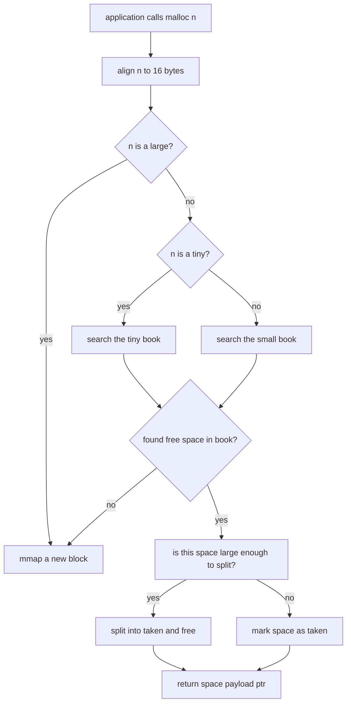
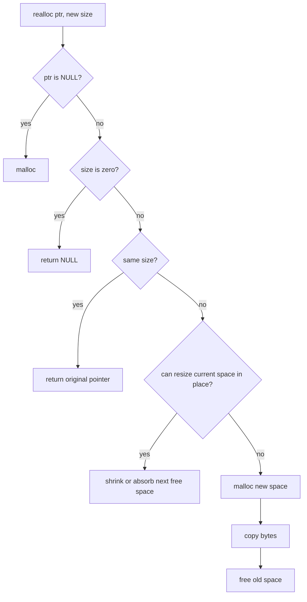

# libft_malloc

A small educational replacement for the C allocation API. The project builds a shared library that provides `malloc`, `free`, and `realloc`, backed by Linux `mmap(2)`/`munmap(2)`. It also includes allocator visualisation helpers, standalone examples, and multithreaded exercises.

This README documents the implementation currently in this repository. It explains both the allocator design and the operating-system concepts around it; it is not a claim that this implementation has all of the hardening or performance features of a production allocator.

## Contents

- [Build](#build)
- [Run a program with the allocator](#run-a-program-with-the-allocator)
- [Tests and demonstrations](#tests-and-demonstrations)
- [Public API](#public-api)
- [Allocator at a glance](#allocator-at-a-glance)
- [Memory layout](#memory-layout)
- [Allocation walkthrough](#allocation-walkthrough)
- [Free and coalescing](#free-and-coalescing)
- [Reallocation](#reallocation)
- [Paging and page alignment](#paging-and-page-alignment)
- [Kernel syscall reduction](#kernel-syscall-reduction)
- [Known limitations](#known-limitations)

## Build

### Requirements

- Linux or another system providing `mmap`, `munmap`, `sysconf`, `pthread`, and `MAP_ANON`.
- `gcc`, `make`, and a POSIX shell.

The Makefile uses `gcc -Wall -Wextra -Werror -fPIC -g`, builds the bundled `libft`, and creates a host-specific shared object:

```text
libft_malloc_<machine>_<system>.so
```

It also creates the stable symlink `libft_malloc.so`.

From the repository root:

```sh
make
```

Useful targets:

```sh
make tests       # Build standalone and library-linked test executables
make clean       # Remove allocator object files
make fclean      # Remove allocator objects and shared-library files
make re          # Clean and rebuild; requires obj/ to exist for clean
make cleanlib    # Clean the bundled libft
make clean_tests # Remove tests_exec/ and tests_lib_exec/
make re_tests    # Rebuild test executables
```

On a completely fresh checkout, use `make` first. The current `clean` target uses `rm -r obj`, so `make re` can fail before the first build if `obj/` does not yet exist.

## Run a program with the allocator

`run_linux.sh` sets both the library search path and `LD_PRELOAD`:

```sh
./run_linux.sh ./your_program arg1 ... argN
```

The wrapper is equivalent to:

```sh
LD_LIBRARY_PATH=. LD_PRELOAD=./libft_malloc.so ./your_program arg1 ... argN
```

The `LD_PRELOAD` method intercepts calls made by the process and routes them to this shared library. It is useful for the tests that include `<stdlib.h>` instead of the project header.

## Tests and demonstrations

Build all configured test executables with:

```sh
make tests
```

The Makefile puts tests that do not link the allocator in `tests_exec/`, and tests that link `libft_malloc.so` in `tests_lib_exec/`.

Run the library-linked examples through the preload wrapper when they need the allocator at runtime:

```sh
./run_linux.sh ./tests_lib_exec/main.out
./run_linux.sh ./tests_lib_exec/main_fragmentation.out
./run_linux.sh ./tests_lib_exec/main_ex.out
./run_linux.sh ./tests_lib_exec/multithread_allocations.out
./run_linux.sh ./tests_lib_exec/multithread_with_sleeps.out
```

The exact executable set is defined by `TESTS` and `TESTS_NEED_LIB` in `Makefile`. The source files exercise:

| File | Purpose |
| --- | --- |
| `test0.c` | Basic allocation and write operations |
| `test1.c` | Repeated 1 KiB allocations |
| `test2.c` | Allocation followed by `free` |
| `test3.c` | Large allocations and large `realloc` |
| `test4.c` | Size-class and diagnostic output demonstration |
| `test5.c` | Returned pointer alignment |
| `main.c` | `malloc`, `realloc`, `free`, and `show_alloc_mem` |
| `main_ex.c` | Extended diagnostics including byte contents and age |
| `main_fragmentation.c` | Freeing in different orders and coalescing |
| `multithread_allocations.c` | Concurrent tiny/small allocations, reallocations, and frees |
| `multithread_with_sleeps.c` | The same workflow with scheduling delays |
| `main_ex.c` | Extended allocation visualisation |

For a quick alignment check:

```sh
./run_linux.sh ./tests_exec/test5.out
```

The diagnostic functions are declared in `includes/malloc.h`:

```c
show_alloc_mem();
show_alloc_mem_ex();
```

`show_alloc_mem` prints block categories and allocated ranges. `show_alloc_mem_ex` additionally reports metadata such as allocation age and whether the space was touched by `realloc`.

## Public API

```c
void  *malloc(size_t size);
void   free(void *ptr);
void  *realloc(void *ptr, size_t size);
void   show_alloc_mem(void);
void   show_alloc_mem_ex(void);
```

`show_alloc_mem` and `show_alloc_mem_ex` are not part of the standard C library; they are included for demonstration and debugging purposes.

## Allocator at a glance

The requested size selects one of three classes:

| Class | User size | Backing strategy |
| --- | ---: | --- |
| Tiny | `0` through `2048` bytes | Reusable arena containing 100 nominal slots |
| Small | `2049` through `131072` bytes | Reusable arena containing 100 nominal slots |
| Large | Greater than `131072` bytes | One mapping sized for the request |

All sizes are rounded up to a 16-byte boundary before space calculations. Tiny and small arenas are page-aligned in size. Large mappings contain only the block header, one space header, and aligned user payload.



## Memory layout

The allocator stores a doubly linked list of blocks for each class. Each block contains a sequence of variable-sized spaces. A space is the metadata immediately before one user allocation or one free region.

The metadata of a space describes:
- payload size
- whether the space is taken or free
- whether the space is the last in the block
- a pointer to the previous space in the block
- its class (tiny, small, or large)

The returned pointer is calculated as:
```text
(char *)space + align_on_16(sizeof(t_space))
```

A book memory structure is:

```text
+-------------------+
| t_block           |  <- block header
+-------------------+
| t_space           |  <- space header
| is_last = 0       | 
| ...               |
+-------------------+
| user payload      |  <- returned pointer points here
+-------------------+
| t_space           |  <- next space header
| is_last = 1       |  
| ...               |
+-------------------+
| user payload      |  <- returned pointer points here
+-------------------+
```

A block is a contiguous memory region that contains one or more spaces. A block gets free when all of its spaces are free.
We keep an empty block of each class to avoid repeated `mmap`/`munmap` calls for small allocations.

## Allocation walkthrough

Suppose the first call is `malloc(42)`:

1. `get_type(42)` selects `TINY_BLOCK`.
2. `align_on_16(42)` produces a 48-byte payload request.
3. The tiny list is scanned for an untaken space large enough for 48 bytes.
4. If none exists, `get_block_size` computes a tiny arena size and `mmap` reserves it.
5. `prepare_block` marks the first space as taken and leaves the remaining arena as one free space when it can hold another header, payload, and 16 bytes.
6. The pointer after the space metadata is returned.

Later allocations reuse free spaces. `allocate_space` either consumes the whole free space when the remainder is too small, or splits it into a taken space and a new free space. When the following space is already free, it combines the remainder with that following space during the split.

The nominal arena formulas are:

```text
tiny  = align_on_page(align16(sizeof(t_block))
                      + 100 * align16(sizeof(t_space))
                      + 100 * TINY_SIZE)

small = align_on_page(align16(sizeof(t_block))
                      + 100 * align16(sizeof(t_space))
                      + 100 * SMALL_SIZE)

large = align16(sizeof(t_block)) + align16(sizeof(t_space)) + align16(request)
```

The code uses the host's page size from `sysconf(_SC_PAGESIZE)` and caches it after the first query.

## Free and coalescing

`free` marks the space as available, then merges adjacent free spaces in both directions:

```text
Before: [free A] [used B] [used C]
free(B)
After:  [free A + free B] [used C]

Before: [free A] [used B] [free C]
free(B)
After:  [free A + free B + free C]
```

The actual implementation first absorbs free spaces to the right, then walks left while the previous space is free. This reduces fragmentation inside an arena without moving live allocations.

When a block becomes one completely free space, the code attempts to unlink and `munmap` it. Large blocks are eligible for this path individually. Tiny and small blocks are intentionally retained when they are the only block of their class, so the allocator keeps a reusable arena available.

## Reallocation

`realloc` follows the usual special cases:

```text
realloc(NULL, n) -> malloc(n)
realloc(ptr, 0) -> free(ptr), returns NULL
realloc(ptr, same size) -> returns ptr
```

For a smaller size, it shrinks in place. If enough bytes remain, a new free space is created after the allocation; if the next space is free, the released bytes are merged into it.

For a larger size, it first checks whether the immediately following space is free and large enough. If so, it expands in place, splitting any useful remainder. Otherwise it:

```text
new_ptr = malloc_without_lock(new_size)
copy old payload into new_ptr
free_without_lock(old_ptr)
return new_ptr
```

The `creation_time` field stores milliseconds shifted left by one bit. `realloc` sets the low bit as a diagnostic flag, so extended output can distinguish a space that has been reallocated.



## Paging and page alignment

Virtual memory is managed in page-sized units. On most current x86-64 Linux systems the base page size is 4096 bytes, but this project asks the running system with `sysconf(_SC_PAGESIZE)` instead of assuming 4096.

For a size `n`, page alignment is:

```text
align_on_page(n) = n                         when n % page_size == 0
                   (n / page_size + 1) * page_size otherwise
```

Tiny and small mapping sizes use this function. That makes the mapping size an integer number of pages, which matches the granularity at which the virtual-memory subsystem maps and unmaps memory. Large mappings are sized from the exact aligned request in this implementation; `mmap` still rounds the underlying mapping operation to page granularity internally.

There are two different alignment concerns here:

```text
16-byte alignment  -> user pointers and metadata spacing
page alignment      -> tiny/small arena mapping sizes
```

The 16-byte rule prevents returned addresses from being unnecessarily misaligned for common C objects. The page rule makes arena boundaries straightforward for the operating system.

## Kernel syscall reduction

A naive allocator could call into the kernel for every `malloc` and `free`. That would make allocation latency depend heavily on syscall and virtual-memory bookkeeping overhead.

This allocator batches small requests:

```text
Application: malloc(32), malloc(64), malloc(128), ...
                 |       |       |
User space:    reuse one mapped tiny arena and split its spaces
                 |
Kernel:        one mmap for the arena, then no syscall per small allocation
```

The practical strategy is:

1. Call `mmap` only when the selected class has no suitable free space.
2. Keep tiny and small mappings in linked lists for reuse.
3. Split free spaces in user space.
4. Coalesce neighbouring free spaces in user space.
5. Call `munmap` only when a whole block can be released.

Large requests intentionally use one mapping per request because reserving a huge shared arena would waste address space or complicate fragmentation management. This reduces internal bookkeeping for large allocations but can increase kernel call frequency for workloads dominated by large objects.

## Known limitations

This is an educational allocator and should not replace a system allocator in production. In particular:

- `free` does not validate that a pointer belongs to one of this allocator's mappings before reading the preceding metadata.
- Invalid pointers remain undefined behavior.
- Tiny and small allocations use first-fit scanning, so long-lived mixed-size workloads can still fragment.
- The library is Linux-oriented and has no portability layer for other operating systems.

**When changing the allocator of your project with this one, inspect this allocator implementation to make sure it handles your workload correctly.**
